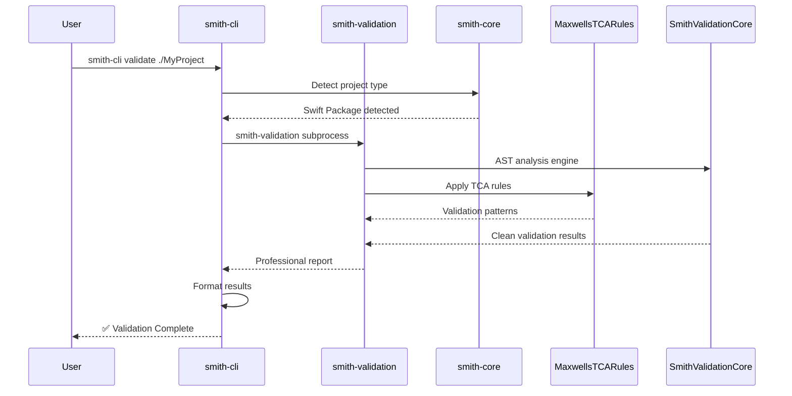

# Smith Tools

**Professional Swift development tools for modern teams that ship quality code**

Smith Tools is a suite of professional-grade utilities that help Swift developers validate architecture, optimize builds, and maintain code quality throughout the development lifecycle.

---

## ✨ Features

- 🏗️ **Architecture Validation** - TCA patterns and architectural rules analysis
- 🚀 **Build Optimization** - Performance monitoring and bottleneck detection
- 🔍 **Smart Analysis** - Automated project detection and dependency insights
- 📊 **Professional Reporting** - Actionable insights with detailed metrics
- 🛠️ **Developer Experience** - Unified CLI interface for all tools

---

## 🚀 Quick Start

```bash
# Install Smith Tools
brew tap Smith-Tools/smith
brew install smith-cli

# Validate your project architecture
smith-cli validate

# Analyze build performance
smith-cli analyze
```

---

## 📦 Ecosystem

Smith Tools provides a comprehensive suite of specialized tools:

### smith-cli
**Unified command-line interface for all Smith Tools**
- Smart project detection (SPM, Xcode, Workspace)
- Orchestration of validation and analysis tools
- Professional reporting with actionable insights

### smith-validation
**Architectural validation engine**
- TCA pattern validation via MaxwellsTCARules
- Pluggable rule system for custom validation
- AST-powered analysis with detailed reporting

### smith-core
**Universal Swift patterns library**
- Project type detection and analysis
- Shared utilities for Smith Tools ecosystem
- Build performance monitoring

### Analysis Tools
- **smith-spmsift** - Swift Package Manager analysis
- **smith-xcsift** - Xcode build analysis
- **smith-sbsift** - Swift build system analysis
- **sosumi** - Apple documentation search

---

## 🎯 What Makes Smith Tools Different

### Lightning Performance
- **2.3 second builds** vs 30+ second legacy tools
- Zero dependency bloat in primary interfaces
- Smart caching and optimization

### Smart Validation
- **TCA architectural rules** by industry experts
- **AST-powered analysis** for accurate insights
- **Professional reporting** with actionable recommendations

### Developer Experience
- **Single unified interface** via smith-cli
- **Smart project detection** across all Swift project types
- **Clean separation** of concerns through subprocess orchestration

---

## 📈 Architecture



---

## 🛠️ Installation

### Homebrew (Recommended)
```bash
brew tap Smith-Tools/smith
brew install smith-cli smith-validation
```

### Swift Package Manager
```swift
dependencies: [
    .package(url: "https://github.com/Smith-Tools/smith-core", from: "1.1.0"),
    .package(url: "https://github.com/Smith-Tools/smith-validation", from: "1.0.7"),
]
```

---

## 📚 Documentation

- **[smith-cli](https://github.com/Smith-Tools/smith-cli)** - CLI interface documentation
- **[smith-validation](https://github.com/Smith-Tools/smith-validation)** - Validation engine guide
- **[smith-core](https://github.com/Smith-Tools/smith-core)** - Core library API
- **[Homebrew Tap](https://github.com/Smith-Tools/homebrew-smith)** - Installation guide

---

## 🤝 Contributing

Smith Tools welcomes contributions! See individual repositories for:
- Development guidelines and coding standards
- Issue reporting and feature requests
- Pull request process and review criteria

---

## 📄 License

All Smith Tools components are released under the MIT License.

---

**Built with ❤️ by the Smith Tools team**
*Professional Swift development tools for teams that ship quality code*