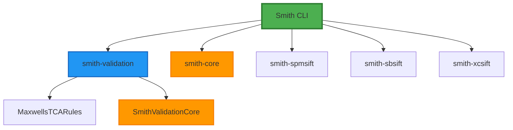

# Smith Tools

> **Professional Swift development tools and validation frameworks for modern development**

Smith Tools provides a comprehensive suite of professional-grade utilities for Swift developers, focusing on architectural validation, build analysis, and development workflow optimization.



## 🚀 Quick Start

```bash
# Install the complete Smith Tools suite
brew tap Smith-Tools/smith
brew install smith-cli smith-validation

# Start using smith-cli as your unified interface
smith-cli --help
```

## 📦 Components

### 🏗️ CLI & Orchestration
- **smith-cli**: **Primary unified interface** for all Smith Tools
  - Orchestrates validation, analysis, and optimization workflows
  - Clean architecture with no SwiftSyntax dependencies (v1.0.5+)
  - Available via `brew install smith-cli`

```mermaid
flowchart LR
    A[User: smith-cli command] --> B{Project Type Detection}
    B -->|SPM Package| C[Swift Package Analysis]
    B -->|Xcode Project| D[Xcode Build Analysis]
    B -->|Unknown| E[General Analysis]

    C --> F[smith-validation]
    D --> G[smith-xcsift]
    E --> H[General Diagnostics]

    F --> I[✅ TCA Validation Results]
    G --> J[✅ Xcode Build Insights]
    H --> K[✅ Environment Info]

    I --> L[smith-cli Output]
    J --> L
    K --> L

    style A fill:#E3F2FD,stroke:#1976D2,stroke-width:2px
    style F fill:#E8F5E8,stroke:#4CAF50,stroke-width:2px
    style L fill:#FFF3E0,stroke:#FF9800,stroke-width:2px
```



### 🔍 Validation Frameworks
- **smith-validation**: **Pluggable architectural validation engine**
  - Rules-based validation for Swift code architecture
  - Supports custom validation rules and TCA patterns
  - Available via `brew install smith-validation`
- **SmithValidationCore**: Core framework for Swift code analysis
  - AST parsing and analysis utilities
  - Shared validation infrastructure

### 📊 Analysis Tools
- **smith-core**: **Universal Swift patterns library**
  - Reusable patterns and utilities for any Swift project
  - Independent of specific architectures
  - Foundation for Smith Tools ecosystem
- **smith-spmsift**: Swift Package Manager build analysis
- **smith-sbsift**: Swift build system analysis
- **smith-xcsift**: Xcode build and project analysis

### 🔎 Documentation & Search
- **sosumi**: **Apple developer documentation search**
  - Comprehensive WWDC session and documentation search
  - Apple developer resources and references

## 🎯 Key Features

### smith-cli - Unified Interface
- **Single command access** to all Smith Tools functionality
- **Smart project detection** (SPM, Xcode, Workspace)
- **Build monitoring** with hang detection and performance analysis
- **TCA architectural validation** through smith-validation integration
- **Development environment analysis** and optimization recommendations

```mermaid
sequenceDiagram
    participant U as User
    participant S as smith-cli
    participant V as smith-validation
    participant C as smith-core
    participant T as MaxwellsTCARules
    participant A as SmithValidationCore

    U->>S: smith-cli validate ./MyProject
    S->>C: Detect project type
    C-->>S: Swift Package detected

    S->>V: smith-validation subprocess
    V->>A: AST analysis engine
    V->>T: Apply TCA rules
    T-->>V: Validation patterns
    A-->>V: Clean validation results
    V-->>S: Professional report

    S->>S: Format results
    S-->>U: ✅ Validation Complete

    Note over S: Clean orchestration interface
    Note over V: Smart validation engine
```



### smith-validation - Architectural Validation
- **Pluggable rule system** for custom validation
- **TCA-specific rules** via MaxwellsTCARules
- **Swift code analysis** with detailed reporting
- **CI/CD integration** ready

### Build Analysis Tools
- **Performance optimization** recommendations
- **Dependency graph analysis**
- **Build bottleneck detection**
- **Resource usage monitoring`

## 🛠️ Installation

### Homebrew (Recommended)
```bash
# Add the Smith Tools tap
brew tap Smith-Tools/smith

# Install individual components
brew install smith-cli          # Unified CLI interface
brew install smith-validation     # Validation engine
brew install smith-core          # Core utilities
```

### Swift Package Integration
Add to your `Package.swift`:

```swift
dependencies: [
    .package(url: "https://github.com/Smith-Tools/smith-core", from: "1.1.0"),
    .package(url: "https://github.com/Smith-Tools/smith-validation", from: "1.0.7"),
]
```

## 📖 Usage Examples

### Project Analysis with smith-cli
```bash
# Analyze current project
smith-cli analyze

# Validate architecture (includes TCA validation)
smith-cli validate

# Detect project type and tools
smith-cli detect

# Monitor build with hang detection
smith-cli monitor-build
```

### Swift Package Integration
```swift
import SmithCore
import SmithValidation

// Quick project analysis
let analysis = SmithCore.quickAnalyze(at: ".")
print("Files: \(analysis.metrics.fileCount ?? 0)")
print("Dependencies: \(analysis.dependencyGraph.targetCount)")
```

### Custom Validation Rules
```swift
import SmithValidationCore

struct CustomRule: ValidatableRule {
    func validate(sourceFile: SourceFileSyntax) -> ViolationCollection {
        // Custom validation logic
        return ViolationCollection(violations: [])
    }
}
```

## 🚀 What's New

### Lightning-Fast Performance
- **2.3 second builds** vs 30+ second legacy versions
- **Zero SwiftSyntax bloat** in smith-cli
- **Subprocess orchestration** for clean separation of concerns

### Smart Validation Engine
- **TCA architectural rules** by MaxwellsTCARules
- **AST-powered analysis** through SmithValidationCore
- **Pluggable rule system** for custom validation patterns

### Developer Experience
- **Single unified interface** via smith-cli
- **Smart project detection** (SPM, Xcode, Workspace)
- **Professional reporting** with actionable insights

## 🌟 Why Smith Tools?

### For Swift Developers
- **Professional-grade analysis** with actionable insights
- **TCA architectural validation** with expert rules
- **Build optimization** recommendations based on real projects
- **Development workflow** integration and automation

### For Teams
- **Consistent validation** across all Swift projects
- **CI/CD integration** ready validation workflows
- **Performance monitoring** and optimization guidance
- **Documentation search** for rapid development

### For Architecture Quality
- **Rule-based validation** for architectural patterns
- **Customizable rules** for project-specific needs
- **Comprehensive analysis** of Swift codebases
- **Professional reporting** for technical reviews

## 📚 Documentation

- **[smith-cli Guide](https://github.com/Smith-Tools/smith-cli)**: Complete CLI usage
- **[smith-validation Guide](https://github.com/Smith-Tools/smith-validation)**: Validation rules and customization
- **[smith-core API](https://github.com/Smith-Tools/smith-core)**: Core utilities and patterns
- **[Homebrew Tap](https://github.com/Smith-Tools/homebrew-smith)**: Installation and updates

## 🤝 Contributing

Smith Tools welcomes contributions! See individual project repositories for:
- **Development guidelines** and coding standards
- **Issue reporting** and feature requests
- **Pull request process** and review criteria
- **Architecture discussions** and design decisions

## 📄 License

All Smith Tools components are released under the MIT License. See individual project repositories for specific licensing details.

---

**Built with ❤️ by the Smith Tools team**
*Professional Swift development tools for the modern developer*