# Smith Tools

**AI-powered Swift development ecosystem for modern teams that ship exceptional code**

Smith Tools is a comprehensive suite of professional-grade utilities that combines intelligent architectural validation, advanced build optimization, and AI-driven knowledge systems to help Swift developers maintain code quality throughout the development lifecycle.

---

## ✨ Features

- 🤖 **AI-Powered Knowledge** - Maxwell v4.0 with 122+ architectural patterns and sub-millisecond search
- 🏗️ **Progressive Intelligence** - Multi-level architectural validation with confidence scoring
- 🚀 **Context-Efficient Analysis** - 43-95% reduction in build output through intelligent parsing
- 📚 **Apple Documentation Integration** - Live Apple docs + 3,216 WWDC sessions with encrypted local storage
- 🔍 **Smart Project Detection** - Automatic analysis across Swift Packages, Xcode projects, and workspaces
- 🛠️ **Unified Developer Experience** - Single CLI interface orchestrating the entire ecosystem

---

## 🚀 Quick Start

```bash
# Install the complete Smith Tools ecosystem
brew tap Smith-Tools/smith
brew install maxwell smith-cli smith-validation smith-spmsift smith-sbsift smith-xcsift

# Get architectural guidance
maxwell "How should I structure TCA reducers for navigation?"

# Validate your project with progressive intelligence
smith-validation analyze --level comprehensive ./MyProject

# Analyze build performance with context efficiency
smith-xcsift build | xcsift
```

---

## 📦 Ecosystem

Smith Tools provides a comprehensive suite of specialized tools organized into three core pillars:

### 🧠 Knowledge & Intelligence

#### **Maxwell** - AI Knowledge System
- **v4.0 Multi-Skill Architecture**: Specialized skills for TCA, visionOS, SharePlay, and Swift patterns
- **SQLite-Powered Database**: 122+ documents with FTS5 search and BM25 ranking
- **Automatic Knowledge Access**: Natural language queries with zero special syntax required
- **Source-Controlled Knowledge**: Git-tracked knowledge repository with automated deployment

#### **Sosumi** - Apple Documentation & WWDC Intelligence
- **Live Apple Documentation**: Real-time search via undocumented Apple JSON endpoints
- **Encrypted WWDC Database**: 3,216 sessions (2014-2025) with AES-256-GCM encryption
- **Dual Rendering Modes**: User mode (summaries) vs Agent mode (full transcripts)
- **Local Search Performance**: 850MB encrypted bundle with instant access

### 🔍 Validation & Analysis

#### **Smith Validation** - Progressive Intelligence Engine
- **Three Analysis Levels**: Critical, Standard, and Comprehensive with progressive enhancement
- **AI-Optimized Output**: JSON format designed for Claude agent integration
- **Enhanced TCA Rules**: Missing error handling, monolithic feature detection, and architectural compliance
- **Automation Confidence**: Scoring system for validation reliability

#### **Smith Core** - Universal Swift Patterns
- **Dependency Injection Patterns**: Modern DI architecture for any Swift project
- **Concurrency Utilities**: Swift Concurrency best practices and safe patterns
- **Access Control Guidance**: Public API design and internal module boundaries
- **Testing Framework Integration**: Modern Swift Testing patterns and methodologies

### ⚡ Build Performance Tools

#### **Swift Build Analysis Tools**
- **smith-xcsift**: Xcode build analysis with 60% context reduction
- **smith-spmsift**: Swift Package Manager analysis with 95%+ context savings
- **smith-sbsift**: Swift build system bottleneck detection and hang analysis

#### **Smith CLI** - Ecosystem Orchestrator
- **Smart Project Detection**: Automatic identification of project type and structure
- **Tool Orchestration**: Intelligent routing to appropriate analysis tools
- **Unified Interface**: Single entry point for the entire Smith Tools ecosystem

---

## 🎯 What Makes Smith Tools Different

### 🤖 AI-First Development
- **Maxwell Knowledge System**: 122+ architectural patterns with sub-millisecond SQLite search
- **Progressive Intelligence**: Three-level analysis (Critical → Standard → Comprehensive)
- **Claude Agent Integration**: AI-optimized JSON outputs for seamless agent workflows
- **Natural Language Interface**: Ask architectural questions in plain English

### ⚡ Context-Efficient Performance
- **43-95% Context Reduction**: Intelligent parsing eliminates log noise
- **Sub-millisecond Search**: FTS5 with BM25 ranking across all knowledge domains
- **Encrypted Local Storage**: 850MB WWDC database with AES-256-GCM encryption
- **Smart Caching**: Optimized for repeated analysis and documentation access

### 🏗️ Modern Swift Architecture
- **TCA-First Validation**: Built-in compliance with The Composable Architecture patterns
- **Platform-Specific Intelligence**: Specialized knowledge for iOS, macOS, visionOS, and SharePlay
- **Progressive Enhancement**: Start with Critical analysis, expand as needed
- **Real-time Build Monitoring**: Hang detection and bottleneck identification

---

## 📈 Ecosystem Architecture

```mermaid
sequenceDiagram
    participant D as Developer
    participant C as Smith CLI
    participant M as Maxwell
    participant V as Smith Validation
    participant S as Sosumi
    participant B as Build Tools

    D->>C: smith-cli analyze ./MyProject
    C->>C: Smart project detection

    alt Architecture Question?
        C->>M: "TCA navigation patterns?"
        M->>M: SQLite knowledge search
        M-->>C: Pattern guidance + examples
    end

    alt Project Validation?
        C->>V: smith-validation --level comprehensive
        V->>V: AST analysis + TCA rules
        V-->>C: AI-optimized JSON report
    end

    alt Documentation Needed?
        C->>S: "SharePlay GroupActivities?"
        S->>S: Live Apple docs + WWDC search
        S-->>C: Current documentation + session references
    end

    alt Build Issues?
        C->>B: smith-xcsift build | xcsift
        B->>B: 60% context reduction analysis
        B-->>C: Bottleneck identification + fixes
    end

    C->>C: Multi-domain synthesis
    C-->>D: ✅ Comprehensive analysis complete
```



---

## 🛠️ Installation

### Homebrew (Complete Ecosystem)
```bash
# Install the complete Smith Tools ecosystem
brew tap Smith-Tools/smith
brew install maxwell smith-cli smith-validation smith-spmsift smith-sbsift smith-xcsift

# Verify installation
maxwell --version && smith-cli --version
```

### Individual Components
```bash
# Core knowledge and CLI
brew install maxwell smith-cli

# Validation and analysis tools
brew install smith-validation smith-spmsift smith-sbsift smith-xcsift
```

### Swift Package Manager
```swift
dependencies: [
    .package(url: "https://github.com/Smith-Tools/smith-core", from: "1.0.0"),
    .package(url: "https://github.com/Smith-Tools/smith-validation", from: "1.0.6"),
]
```

### Script Installation
```bash
# Install directly from source
cd /Volumes/Plutopian/_Developer/Smith\ Tools/Smith
./install.sh
```

---

## 📚 Documentation & Resources

### Core Documentation
- **[Maxwell Knowledge Base](https://github.com/Smith-Tools/Maxwell-data-private)** - 122+ architectural patterns
- **[Smith CLI](https://github.com/Smith-Tools/Smith)** - Ecosystem orchestrator guide
- **[Smith Validation](https://github.com/Smith-Tools/smith-validation)** - Progressive intelligence engine
- **[Smith Core](https://github.com/Smith-Tools/smith-core)** - Universal Swift patterns

### Specialized Tools
- **[smith-spmsift](https://github.com/Smith-Tools/smith-spmsift)** - Swift Package Manager analysis
- **[smith-xcsift](https://github.com/Smith-Tools/smith-xcsift)** - Xcode build analysis
- **[smith-sbsift](https://github.com/Smith-Tools/smith-sbsift)** - Swift build system analysis
- **[sosumi](https://github.com/Smith-Tools/sosumi)** - Apple documentation & WWDC search

### Distribution
- **[Homebrew Tap](https://github.com/Smith-Tools/homebrew-smith)** - Installation and updates

---

## 🎯 Use Cases & Workflows

### 🏗️ Architectural Decision Making
```bash
# Get TCA patterns for complex navigation
maxwell "How should I handle deep linking with multiple TCA features?"

# Validate architectural compliance
smith-validation analyze --level comprehensive ./MyApp

# Review Apple guidelines for SharePlay integration
sosumi "GroupActivities lifecycle management"
```

### 🚀 Performance Optimization
```bash
# Identify build bottlenecks
smith-xcsift build | xcsift

# Analyze package dependencies
smith-spmsift analyze ./MyPackage

# Monitor build hangs in real-time
smith-sbsift monitor --hang-detection
```

### 📚 Knowledge Discovery
```bash
# Search WWDC sessions for visionOS patterns
sosumi wwdc "spatial personas" --sessions 2024,2025

# Find Swift concurrency patterns
maxwell "Actor isolation with @MainActor"

# Get Apple documentation updates
sosumi "SwiftUI @Observable" --live-docs
```

---

## 🔄 Recent Developments

### 🆕 New in v4.0
- **Maxwell Knowledge System**: SQLite-powered database with 122+ architectural patterns
- **Progressive Intelligence**: Three-level validation analysis (Critical → Standard → Comprehensive)
- **Encrypted WWDC Archive**: 3,216 sessions with AES-256-GCM encryption
- **AI-Optimized Workflows**: JSON outputs designed for Claude agent integration

### ⚡ Performance Improvements
- **43-95% Context Reduction**: Intelligent parsing eliminates build log noise
- **Sub-millisecond Search**: FTS5 with BM25 ranking across knowledge domains
- **Real-time Build Monitoring**: Hang detection and bottleneck identification
- **Smart Caching**: Optimized for repeated analysis workflows

### 🏗️ Architecture Evolution
- **Multi-Skill System**: Specialized Maxwell skills for TCA, visionOS, SharePlay, and Swift patterns
- **Progressive Enhancement**: Start with Critical analysis, expand as project complexity grows
- **Platform-Specific Intelligence**: Specialized knowledge for all Apple platforms
- **Source-Controlled Knowledge**: Git-tracked patterns with automated deployment

---

## 🤝 Contributing

Smith Tools welcomes contributions! We're actively developing:

- **Knowledge Base Expansion**: Add architectural patterns to Maxwell-data-private
- **Validation Rules**: Enhance TCA and architectural compliance checking
- **Build Tool Integration**: Extend context-efficient parsing to new scenarios
- **Documentation**: Improve coverage of Apple platform patterns

**Development Guidelines:**
- Follow Swift best practices and TCA patterns in all contributions
- Include comprehensive tests and documentation
- Ensure AI-optimized outputs for agent integration
- Validate with Smith tools before submitting

See individual repositories for specific contribution guidelines and issue reporting.

---

## 📊 Ecosystem Metrics

- **122+ Knowledge Documents**: Covering TCA, SwiftUI, visionOS, SharePlay, and Swift patterns
- **3,216 WWDC Sessions**: 2014-2025 with encrypted local storage
- **43-95% Context Reduction**: Across all build analysis tools
- **Sub-millisecond Search**: FTS5 with BM25 ranking
- **Multi-Platform Support**: iOS, macOS, visionOS, and cross-platform patterns

---

## 📄 License

All Smith Tools components are released under the MIT License.

---

**Built with ❤️ by the Smith Tools team**
*AI-powered Swift development ecosystem for modern teams that ship exceptional code*